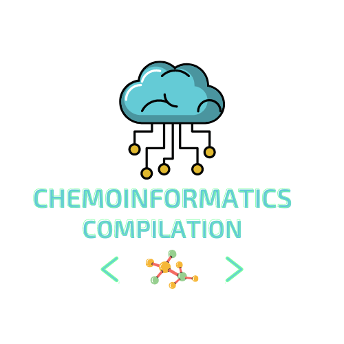

# Chemoinformatics-compiliation

 
  

## Introduction

This repository contains a collection of free and open-source chemoinformatic tools. The tools in this repository are used for a variety of tasks, such as molecular structure handling, chemical similarity calculation, and molecular property prediction.

The tools in this repository are provided as-is, and there is no warranty of any kind. The user is responsible for ensuring that the tools are used safely and responsibly.

Contribution

Contributions to this repository are welcome. If you have a chemoinformatic tool that you would like to add to the repository, please submit a pull request.

License

The tools in this repository are licensed under the MIT License.

**Chemoinformatic Tools**

* [Rdkit](https://www.rdkit.org/) or [here](https://www.rdkit.org/docs/Cookbook.html
):is a free and open-source cheminformatics toolkit for Python. It is one of the most popular chemoinformatic tools available, and it is used by researchers and developers around the world. RDKit provides a wide range of features, including molecular structure handling, chemical similarity calculation, and molecular property prediction.
        
* [ChemmineR](https://bioconductor.org/packages/devel/bioc/vignettes/ChemmineR/inst/doc/ChemmineR.html) : is a free and open-source cheminformatics software package for Windows, macOS, and Linux. It provides a graphical user interface for performing a variety of chemoinformatic tasks, such as molecular structure visualization, chemical similarity calculation, and molecular property prediction.

* [DataWarrior](https://openmolecules.org/datawarrior/) : An Open-Source Program for Data Visualization and Analysis with Chemical Intelligence

* [Datamol](https://github.com/datamol-io/datamol) : The Datamol library is a powerful tool for working with molecules in Python. It is designed to be a lightweight layer built on top of RDKit.

* [deepchem](https://deepchem.io/) : DeepChem is a Python library for machine learning and deep learning on molecular and quantum datasets. It is built on top of PyTorch, and other popular ML frameworks. It is designed to make it easy to apply ML to new domains, and to build and benchmark new models. It is also designed to make it easy to use ML in production, by providing easy-to-use model export and deployment APIs

**Active Learning Tools**

* [modAL](https://modal-python.readthedocs.io/en/latest/) :  an active learning framework for Python3, designed with modularity, flexibility and extensibility in mind. Built on top of scikit-learn, it allows you to rapidly create active learning workflows with nearly complete freedom. What is more, you can easily replace parts with your custom built solutions, allowing you to design novel algorithms with ease.

**Databases**

* [ChemSpider](http://www.chemspider.com/): is a free online database of chemical compounds. It provides information on the structure, properties, and biological activity of millions of compounds. ChemSpider is used by researchers, students, and the general public.

* [PubChem](https://pubchem.ncbi.nlm.nih.gov/):  is a free online database of chemical compounds. It provides information on the structure, properties, and biological activity of millions of compounds. PubChem is used by researchers, students, and the general public.

**Tools for descriptors calculation**

* [Rdkit](https://www.rdkit.org/docs/source/rdkit.Chem.Descriptors.html)
* [Mordred](https://github.com/mordred-descriptor/mordred)
* [Chamxon](https://chemaxon.com/) : Free licence for academics
* [CDK](http://www.rguha.net/code/java/cdkdesc.html)
* [MOLD2](https://www.fda.gov/science-research/bioinformatics-tools/mold2)
...

**ADMET**

* [SwissADME](http://www.swissadme.ch/)
* [pkCSM](https://biosig.lab.uq.edu.au/pkcsm/prediction)
* [AdemLab](https://admet.scbdd.com/)
* [admetSAR](http://lmmd.ecust.edu.cn/admetsar2)
**Visualization**

* [ChimeraX](https://www.cgl.ucsf.edu/chimerax/)
* [PyMol](https://sourceforge.net/projects/pymol/)
* [VMD](https://www.ks.uiuc.edu/Research/vmd/)
* [DS Visualizer](https://discover.3ds.com/discovery-studio-visualizer-download)